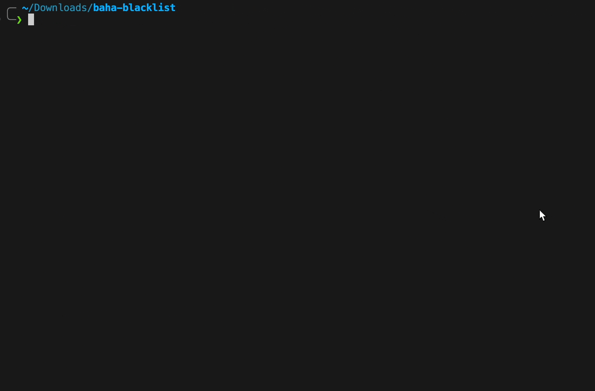

# 巴哈姆特黑名單工具 + 黑名單合輯

管理巴哈黑名單的工具，也包括黑名單合輯清單



## 說明

巴哈沒有提供黑名單管理、匯出、匯入的介面，所以自己寫了一個，主要提供這三個功能

1. 根據黑名單來源自動更新黑名單
2. 匯出自己的黑名單
3. 從原有的黑名單中移除特定條件的用戶

特定條件是登入次數小於一定次數或者上次登入日期過久的用戶，因為看到這些用戶的機會很小了，所以移除這些人的黑名單空出給其他人（巴哈黑名單[人數上限 1500](https://forum.gamer.com.tw/C.php?bsn=60404&snA=39366)）。

## 安裝和使用

下載腳本後

1. 使用 `pip install -r requirements.txt` 安裝
2. 用 [Cookie-Editor](https://chromewebstore.google.com/detail/cookie-editor/hlkenndednhfkekhgcdicdfddnkalmdm) 匯出 netscape 格式的 cookie 並且儲存到同資料夾的 `cookies.txt`
3. 使用 `python run.py` 執行，使用範例如下

```sh
python run.py -u <你的帳號名稱>
```

如果什麼都不輸入預設的三種功能都會執行，使用 `-h` 參數可以看到所有輸入選項，編輯 `config.json` 可以修改預設值（例如 username），之後使用就不用打這麼多字。

## 注意事項和使用細節

1. 等待時間久一點讓他慢慢跑沒關係，設定太快對網站來說是攻擊，帳號可能會被 ban。
2. 這個黑名單列表會自動更新，`blacklist_src` 預設會根據我的黑名單更新，已經 ban 了很多碎念大師了，也可以用你找到的黑名單列表進行更新。
3. 出現問題先嘗試更新 cookie 檔案以及修改 `user_agent`，可以到 https://www.whatsmyua.info/ 複製 user_agent。
4. 根據 [aniGamerPlus](https://github.com/miyouzi/aniGamerPlus) 的建議，可以使用無痕瀏覽器登入巴哈以取得程式碼專用的 cookies，詳細使用方式請見[文檔](https://github.com/miyouzi/aniGamerPlus?tab=readme-ov-file#cookietxt)。

## 起因

我只想開心看動畫偏偏有人一直抱怨= =吐槽劇情跟碎碎念是兩回事欸，把他們都 ban 了之後想說可以分享這個名單，又發現巴哈沒有匯入工具所以自己寫了一個黑單工具。
